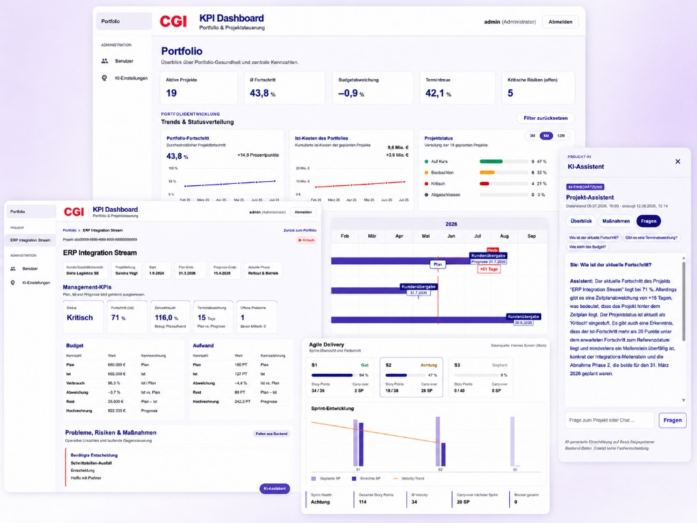

# CGI KPI Dashboard

KPI-Dashboard für Projekt- und Portfoliosteuerung mit zentralen KPIs,
Risikoüberwachung und optionalen KI-gestützten Auswertungen.

## Überblick

Das Dashboard gibt Führungskräften und Projektleitern einen zentralen Überblick
über parallele Kundenprojekte. Kennzahlen zu Fortschritt, Budget, Terminen und
Risiken werden deterministisch im Backend berechnet. Eine optionale KI-Schicht
unterstützt bei Interpretation und Zusammenfassung ohne KPIs zu ersetzen.

Es handelt sich um ein **Greenfield-Projekt** mit **Simulations-/Mock-Daten**.
Die Demo ist für lokale Evaluierung und Präsentationen gedacht,
nicht für den Betrieb mit produktiven Kundendaten.

<p align="center">
  
</p>

<p align="center"><em>Portfolioübersicht, Projektdetail, Agile Delivery und optionaler KI-Assistent</em></p>

## Features

- Portfolioübersicht mit Filtern und Projektliste
- Zentrale Projekt-KPIs (Fortschritt, Budget, Termine, Status)
- Risiko- und Problemüberwachung
- Projekt-Drill-down mit Stammdaten, Trends und Berichtsstandsvergleich
- Kapazitätsinformationen
- Agile-/Delivery-Informationen (Vorgehensmodell, Sprint-Kennzahlen)
- Optionale KI-Analysen (Portfolio-Muster, Projekt-Assistent, Fragen)
- Demo-Daten über Flyway-Seeds

## Quick Start

### Voraussetzungen

- Git
- Docker Desktop (inkl. Docker Compose)

### Start

```bash
git clone https://github.com/davidklostermann/cgi-kpi-dashboard.git
cd cgi-kpi-dashboard
cp .env.example .env
docker compose up --build
```

Unter Windows (PowerShell):

```powershell
git clone https://github.com/davidklostermann/cgi-kpi-dashboard.git
cd cgi-kpi-dashboard
Copy-Item .env.example .env
docker compose up --build
```

Danach im Browser:

**http://localhost:4200**

### Demo-Login

| Feld | Wert |
|------|------|
| Benutzer | `admin1` |
| Passwort | `DemoAdmin1!` |

Beim ersten Start legt das Backend diesen Admin an, wenn noch keine Benutzer
existieren (`BOOTSTRAP_ADMIN_USERNAME` / `BOOTSTRAP_ADMIN_PASSWORD` in `.env`,
Defaults siehe `.env.example` und `docker-compose.yml`).

Wichtig: Nach Änderungen an den Bootstrap-Credentials einen kompletten Reset
ausführen (`docker compose down -v`), damit die Datenbank neu erzeugt wird.

### Stop / Reset

```bash
docker compose down
```

Kompletter Reset inklusive Datenbank:

```bash
docker compose down -v
docker compose up --build
```

## KI-Funktionen

Das Dashboard enthält optionale KI-gestützte Funktionen zur Analyse und
Zusammenfassung von Projekt- und Portfolioinformationen.

- Die KI-Anbindung erfolgt ausschließlich serverseitig.
- API-Keys werden nicht im Repository gespeichert.
- Das Dashboard und sämtliche klassischen KPI-Funktionen funktionieren unabhängig von der KI.
- Für die Nutzung der KI-Funktionen kann ein eigener KI-API-Key hinterlegt werden.
- Ist kein API-Key vorhanden, bleiben die KI-Funktionen deaktiviert, ohne die übrige Anwendung zu beeinträchtigen.

Die notwendige Konfiguration ist in `.env.example` dokumentiert.

## Documentation

- [Product Overview](docs/product-overview.md)
- [Requirements](docs/requirements.md)
- [Architecture](docs/architecture.md)
- [Planning (Epics & Stories)](docs/planning/README.md)

## Tech Stack

- Frontend: Angular 22, TypeScript, Angular Material, RxJS
- Build (Frontend): Node.js 22, npm
- Backend: Spring Boot 3.5 / Java 21, Maven
- Datenbank: PostgreSQL 16 + Flyway
- Auth: Session-Cookie + CSRF
- Demo-Betrieb: Docker Compose, nginx
- Tests: Vitest (Frontend), JUnit (Backend)
- Optional: KI-Anbindung (API-Key, serverseitig)

## Development Approach

Das Projekt wurde mit einem strukturierten BMAD-basierten
Produktentwicklungsprozess geplant und umgesetzt. Die wichtigsten
Epic- und Story-Dokumente liegen unter [`docs/planning`](docs/planning/README.md).

## License

MIT License © 2026 David Klostermann — siehe [LICENSE](LICENSE).
