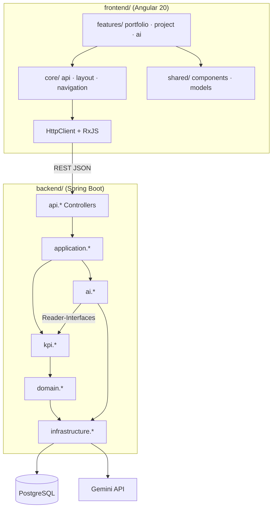
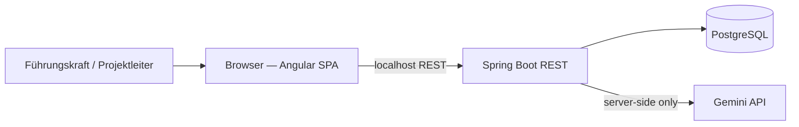

# Architecture Spine — cgi-kpi-dashboard

## Design Paradigm

**Layered Modular Monolith** — ein deploybares Spring-Boot-Backend, Schichten top-down:

| Schicht | Paket (Seed) | Verantwortung |
|---|---|---|
| API | `…api` | REST-Controller, Request/Response-DTOs, Validierung |
| Application | `…application` | Use Cases, Orchestrierung, Transaktionsgrenzen |
| Domain | `…domain` | Entitäten, Repositories (Interfaces), Domänenregeln |
| Infrastructure | `…infrastructure` | JPA, Flyway, externe Adapter (Gemini-Client) |

Querschnittliche Module (Packages, nicht Deployables):

- **`kpi.*`** — deterministische KPI-Berechnung, KPI-DTOs und **Reader-/Service-Interfaces** (einzige Datenquelle für `ai.*`)
- **`ai.*`** — Gemini-Adapter und AI-Use-Cases; liest KPI-/Projektdaten **ausschließlich** über `kpi.*`-Reader, nie über JPA/Domain

Frontend: **Angular 20 SPA** (TypeScript, SCSS), spricht ausschließlich REST mit dem Backend über **Angular HttpClient**. UI auf Basis **CGI Experience Design System 19.0.0**, **Angular Material** und **Angular CDK**. Referenzpaket (Planung): `frontend/vendor/cgi-sentry-angular-components-lib-19.0.0.tgz` — Integration erst in Implementierungsphase.

## Invariants & Rules

### AD-1 — Single deployable backend [ADOPTED]

- **Binds:** Backend, Deployment
- **Prevents:** Microservice-Split, getrennte KPI-/AI-Services im Pilot
- **Rule:** Genau ein Spring-Boot-Artefakt. Kein separater „AI-Service" im MVP.

### AD-2 — Strict KPI / AI package boundary [ADOPTED]

- **Binds:** `kpi.*`, `ai.*`, FR-9, FR-10, FR-13, FR-14
- **Prevents:** KPI-Berechnung in Gemini-Prompts, Gemini-Logik in KPI-Services, zirkuläre Abhängigkeiten, uneinheitliche „freigegebene Daten" für Gemini
- **Rule:** `ai.*` erhält KPI- und Projektdaten **ausschließlich** über definierte Reader-/Service-Interfaces aus `kpi.*` (z. B. `ApprovedProjectDataReader`, `PortfolioKpiReader`), die freigegebene DTOs zurückgeben. `ai.*` importiert **weder** `domain.*` **noch** JPA-Repositories **noch** Persistence aus `infrastructure.*`. `kpi.*` importiert **nie** `ai.*`. KPI-Werte werden in `kpi.*` berechnet und über Reader an `ai.*` übergeben — nicht neu berechnet oder aus Prompts abgeleitet.

### AD-3 — KPIs are backend-computed facts [ADOPTED]

- **Binds:** FR-9, FR-1..FR-8, FR-19
- **Prevents:** Frontend- oder Gemini-seitige KPI-Fakten, inkonsistente Zahlen, divergente Aggregationslogik
- **Rule:** **Jede KPI-Zahl entsteht in `kpi.*`.** `api.*` und `application.*` orchestrieren und serialisieren nur — keine KPI-Aggregation oder -Berechnung außerhalb `kpi.*`. Alle KPI-Endpunkte liefern ausschließlich backend-berechnete Werte. Frontend rendert; rechnet nicht nach.

### AD-4 — Gemini is read-only interpretation [ADOPTED]

- **Binds:** FR-11..FR-16, FR-13, FR-14, FR-15
- **Prevents:** KI-seitige DB-Writes, verbindliche Entscheidungen, erfundene KPI-Werte, direkter Entity-Zugriff
- **Rule:** Gemini-Use-Cases rufen ausschließlich `kpi.*`-Reader auf, bauen Prompts aus freigegebenen DTOs, rufen die Gemini API auf und geben Text zurück. Kein JPA-`save` aus `ai.*`. Kein KPI-Wert in der Antwort ohne Backend-Quelle über Reader-DTOs. **Das Angular-Frontend ruft Gemini niemals direkt auf.**

### AD-5 — REST surface: facts vs. nested AI [ADOPTED]

- **Binds:** Portfolio-Übersicht, Projekt-Detail, FR-4, FR-11, FR-12, FR-16, FR-18
- **Prevents:** Vermischte KPI/KI-Responses, Portfolio-Q&A (Non-Goal)
- **Rule:**
  - **Fakten (KPI):** `/api/portfolio/*`, `/api/projects/*` — keine KI-Texte in KPI-Responses.
  - **Portfolio-KI:** `GET /api/portfolio/ai/trend-analysis` (FR-4).
  - **Projekt-KI (nested):** `/api/projects/{id}/ai/summary`, `/api/projects/{id}/ai/forecast`, `POST /api/projects/{id}/ai/qa` (FR-11, FR-12, FR-16).
  - Kein portfolio-weites Freitext-Q&A (FR-18). Nested AI-Pfade unter `/api/portfolio/ai/` und `/api/projects/{id}/ai/` sind erlaubt; kein generischer `/api/ai/chat`.

### AD-6 — No authentication in pilot [ADOPTED]

- **Binds:** FR-19, Pilot-Betrieb
- **Prevents:** Vorzeitige IAM-Komplexität
- **Rule:** Kein Auth-Middleware, keine Rollenprüfung im MVP. Annahme: localhost / internes Netz. CORS nur für Dev-Origin (Angular `ng serve`, typisch `:4200`).

### AD-7 — Independent loading: facts vs. AI panels [ADOPTED]

- **Binds:** FR-15, EXPERIENCE.md State Patterns
- **Prevents:** KI-Ausfall blockiert KPI-UI; gemeinsamer Loading-State
- **Rule:** Frontend nutzt **getrennte RxJS-Streams pro Fakten-Bereich und pro KI-Panel** über typisierte API-Services in `core/api/`. **Keine gemeinsame Parent-Observable/-Signal**, die Error/Invalidation zwischen Fakten und KI koppelt. **Angular Signals** für lokalen UI-Zustand (Loading, Error, Retry pro Panel). KI-Fehler zeigen Panel-Fehler + Retry; Fakten-Streams bleiben aktiv. **Keine globale State-Management-Bibliothek** (kein NgRx) im MVP.

### AD-8 — Secrets server-side only [ADOPTED]

- **Binds:** FR-9, PRD Constraints
- **Prevents:** Gemini-Key im Frontend, Git, Browser
- **Rule:** `GEMINI_API_KEY` nur als Backend-Umgebungsvariable / lokale `.env` (gitignored). Nie in Frontend-Bundle, `environment.ts` oder Repository.

### AD-9 — Local pilot runtime [ADOPTED]

- **Binds:** Demo auf Arbeitsrechner
- **Prevents:** Docker als Pflicht für den Pilot
- **Rule:** Entwicklung und Demo: lokale PostgreSQL + `mvn spring-boot:run` (Backend) + `ng serve` (Frontend). Kein Docker-Compose im MVP-Scope.

### AD-10 — Feature-based Angular architecture [ADOPTED]

- **Binds:** Frontend-Struktur, Wartbarkeit
- **Prevents:** God-Components, HttpClient in Präsentationskomponenten, untypisierte API-Aufrufe
- **Rule:**
  - Feature-Module unter `features/portfolio`, `features/project`, `features/ai`.
  - **Lazy Loading** für größere Featurebereiche (`portfolio`, `project`).
  - **Keine direkten HttpClient-Aufrufe** aus Präsentationskomponenten — nur über `core/api`-Services.
  - **RxJS** für Serverkommunikation; **Signals** für lokalen UI-Zustand.
  - CGI EDS / Angular Material für Shell und Standard-UI; domänenspezifische Visualisierungen in `shared/components`.

### AD-11 — CGI Experience Design System as UI foundation [ADOPTED]

- **Binds:** UX-DRs, Corporate Design
- **Prevents:** Ad-hoc-UI, inkonsistente Navigation, fehlende Enterprise-Anmutung
- **Rule:** Anwendungshülle über CGI Top Navigation, Side Navigation, Navigation Content, Breadcrumbs. Farben und Typografie gemäß CGI Color System und UX Guidelines (siehe `DESIGN.md`). Paket `cgi-sentry-angular-components-lib` 19.0.0 als Zielkomponentenbibliothek — Installation in Implementierungsphase.

### Dependency direction



## Consistency Conventions

| Concern | Convention |
|---|---|
| Naming (REST) | Plural resources: `/api/projects`, `/api/portfolio`. Nested AI unter `/ai/…`. |
| Naming (Java) | Packages lowercase: `com.cgi.kpi.dashboard.kpi`, `.ai`, `.api`. |
| Naming (Frontend) | Feature folders: `features/portfolio`, `features/project`, `features/ai`; Services: `*ApiService` in `core/api`. |
| IDs | UUID strings in JSON und als DB-PK (`UUID` / `uuid` column). Kein Long/String-Mix. |
| Dates | ISO-8601 (`Instant` / `OffsetDateTime`) in API; UTC speichern. |
| API errors | JSON `{ "code": "…", "message": "…" }`; HTTP-Status semantisch (4xx/5xx). KI-Ausfall: 503 auf AI-Endpunkten, Fakten-Endpunkte unberührt. |
| KPI vs. AI response | KPI-Responses: numerisch/strukturiert, kein Feld `aiGenerated`. AI-Responses: `{ "text": "…", "aiGenerated": true, "disclaimer": "…" }`. |
| Config | Backend: `application.yml` + env vars. Frontend: `environment.apiBaseUrl` only — keine Secrets. |
| Logging | Strukturierte Logs; Gemini-Prompts/Responses nicht vollständig loggen (Datenschutz-Pilot). |
| Auth | Keine — siehe AD-6. |
| Mock seed | Reproduzierbar via Flyway; gleiche UUIDs über Umgebungen hinweg im Pilot. |

## Stack

| Name | Version |
|---|---|
| Java | 21 |
| Spring Boot | 3.5.16 |
| Maven | 3.9.x |
| Spring Data JPA | (via Boot BOM) |
| PostgreSQL | 16.x |
| Flyway | (via Boot) |
| Jakarta Bean Validation | (via Boot) |
| Spring Boot Actuator | (via Boot) |
| JUnit / Spring Boot Test | (via Boot) |
| Angular | 20.x |
| TypeScript | 5.x |
| SCSS | (via Angular) |
| Angular Material | (via Angular) |
| Angular CDK | (via Angular) |
| CGI Experience Design System | 19.0.0 |
| RxJS | (via Angular) |
| Angular Signals | (via Angular) |
| Gemini API (Google) | REST, server-side SDK or HTTP client |

**Nicht im MVP-Stack:** React, Vite, Recharts, TanStack Query, NgRx, Docker (Pflicht).

## Structural Seed



**Lokaler Lauf:** PostgreSQL (lokal) · Backend `:8080` · Frontend Angular `:4200` mit Dev-Proxy `/api` → Backend.

```text
cgi-kpi-dashboard/
  backend/                    # Maven / Spring Boot
    src/main/java/.../
      api/                    # REST controllers (portfolio, projects, ai nested)
      application/            # use cases
      domain/                 # entities, repository interfaces
      kpi/                    # KPI calculation, DTOs
      kpi/reader/             # Reader interfaces — einzige AI-Datenquelle
      ai/                     # Gemini use cases; ruft nur kpi.reader auf
      infrastructure/         # JPA repos, Gemini client, config
    src/main/resources/
      db/migration/           # Flyway + reproduzierbarer Mock-Seed
  frontend/                   # Angular 20 / TypeScript / SCSS
    src/app/
      core/
        api/                  # typisierte PortfolioApiService, ProjectApiService, AiApiService
        interceptors/
        error-handling/
        layout/               # CGI Shell-Wrapper
        navigation/           # Top Nav, Side Nav, Breadcrumbs
        services/
      shared/
        components/           # kpi-card, status-badge, gantt-timeline, …
        models/
        pipes/
        directives/
        utilities/
      features/
        portfolio/            # lazy-loaded
        project/              # lazy-loaded
        ai/                   # KI-Panel-Komponenten (shared von portfolio/project)
      app.module.ts
    vendor/
      cgi-sentry-angular-components-lib-19.0.0.tgz  # Referenz, noch nicht installiert
  README.md                   # lokaler Start (PG, env, mvn, ng serve)
```

## Frontend Layout Architecture

| Bereich | Anteil (Desktop 12-Spalten) | Inhalt |
|---|---|---|
| Navigation | CGI Side Navigation (fix) | Portfolio, Projekte |
| Hauptbereich | 8–9 Spalten | Fakten: KPIs, Zeitleiste, Tabelle, Diagramme |
| KI-Bereich | 3–4 Spalten | KI-Panels (Trend, Summary, Prognose, Q&A) |

**Tablet/Mobil:** KI-Bereich **unter** Hauptinhalt; einklappbare Navigation; Filter responsiv; Tabellen horizontal scrollbar.

## Data Visualization (Gantt & Charts)

- **Keine verbindliche Chart-Bibliothek** im MVP-Architecture-Scope.
- **Gantt/Zeitleiste:** eine Zeile pro Projekt; Projektname; Start/Ende; Zeitachse; heute; Meilensteine; Plan-Ist-Abweichung; ausgeschriebener Status; Legende; Textzusammenfassung; Tastatur; horizontales Scrollen. Umsetzung geplant mit **Angular + HTML + CSS + SVG**.
- **Keine dekorativen Donut-Charts**, keine Tacho-Gauges.
- Trend-/Verlaufsdiagramme: beschriftete Achsen und Legende; Bibliothekswahl **Deferred** bis Implementierung bei nachgewiesenem Bedarf.

## Capability → Architecture Map

| Capability / FR | Lives in | Governed by |
|---|---|---|
| Portfolio-KPI-Karten, Tabelle, Diagramme (FR-1..FR-3) | `api` Portfolio + `kpi.*` + `features/portfolio` | AD-3, AD-5 |
| Portfolio-Trendanalyse (FR-4) | `api` `/portfolio/ai/trend-analysis` + `ai.*` + `features/ai` | AD-2, AD-4, AD-5 |
| Projekt-Kernkennzahlen, Risiken (FR-5, FR-6) | `api` Projects + `kpi.*` + `features/project` | AD-3 |
| Navigation, Filter (FR-7, FR-8) | `core/navigation` + `features/portfolio` | AD-5, AD-7, AD-10 |
| Backend-KPI-Berechnung (FR-9) | `kpi.*` | AD-2, AD-3 |
| KPI/KI-Trennung UI (FR-10) | Layout + getrennte RxJS-Streams | AD-5, AD-7, AD-11 |
| Management-Zusammenfassung, Prognose (FR-11, FR-12) | `ai.*` + `features/ai` | AD-4, AD-5 |
| Keine KI-Writes (FR-13) | `ai.*` | AD-4 |
| Keine erfundenen Daten (FR-14) | `ai.*` via `kpi.reader` | AD-2, AD-4 |
| Graceful Degradation (FR-15) | `ai.*` + Frontend Signals/Error UI | AD-7 |
| Projekt-Q&A, Chips (FR-16, FR-17) | `POST …/ai/qa` + `features/ai` | AD-4, AD-5 |
| Kein Portfolio-Q&A (FR-18) | API design | AD-5 |
| Mock-Portfolio (FR-19) | Flyway seed + `domain` | AD-3 |
| CGI Shell (Navigation) | `core/layout`, `core/navigation` | AD-10, AD-11 |

## Deferred

| Topic | Reason |
|---|---|
| KPI-Formeln & Schwellenwerte (Ampel, Aggregation) | Fachlich `[OFFEN]` im PRD; Pilot mit Mock-Logik |
| Konkretes Entitätsmodell (Felder pro Risiko/Problem) | Story-Ebene |
| Gemini Prompt-Schema & freigegebene Datenfelder | Prompt-Engineering in Stories |
| Speicherung von KI-Ausgaben | PRD `[OFFEN]`; MVP default: nicht persistieren |
| Authentifizierung & Rollen | Nach Pilot; AD-6 bewusst ohne Auth |
| Docker Compose / Container-Deploy | Bewusst lokal (AD-9) |
| Spring Boot 4.x Upgrade | 3.5.x Pilot; Upgrade vor Production |
| CI/CD Pipeline | Nicht MVP-kritisch |
| Echte Datenquellen-Anbindung | Nach Pilot |
| Chart-Bibliothek (falls nötig) | Erst bei Implementierung nach Bedarf |
| jpackage / Windows-EXE | Nicht MVP |
| Produktives Deployment / CGI-Infrastruktur | Nicht MVP |
| Produktive Gemini-Konfiguration | Nicht MVP |
| Betrieb auf eingeschränktem Arbeitsrechner | Nicht MVP |
